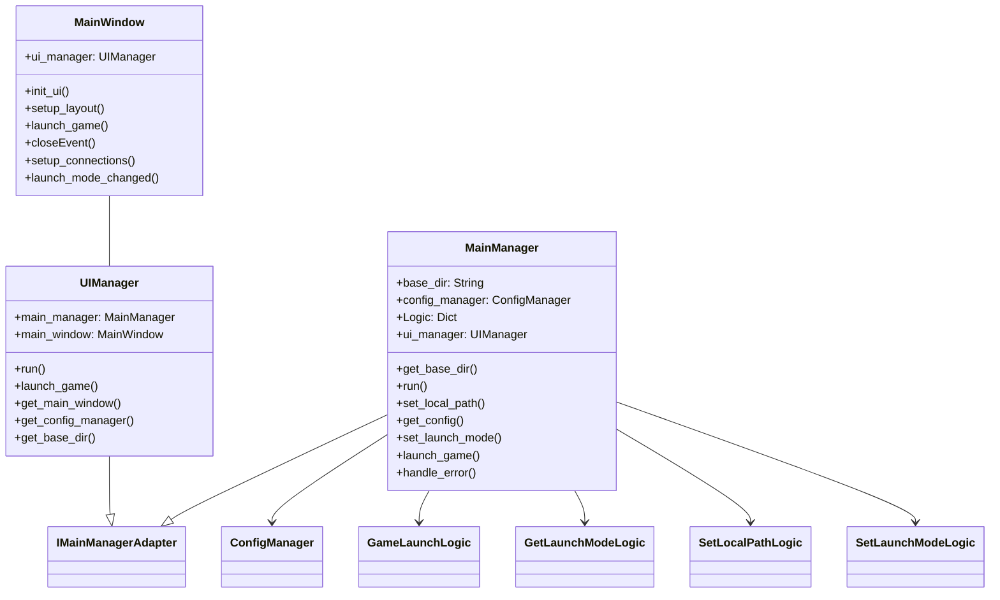

# System Design

## モジュール構成

*   **`MainManager`**: アプリケーション全体の制御と、各モジュール間の連携を行う。
*   **`UIManager`**: UIとビジネスロジックの接続を行う。
*   **`MainWindow`**: UIを構築する。
*   **`ConfigManager`**: 設定ファイルの読み書きを管理する。
*   **`ILogic`**: Logicモジュールのインターフェースを定義する。
*   **`IMainManagerAdapter`**: `MainManager`とGUIの間のインターフェースを定義する。
*   **`Logic`**: ビジネスロジックを記述する。
    *   `set_local_path_logic.py`: ローカルパスを設定する。
    *   `game_launch_logic.py`: ゲームを起動する。
    *   `get_launch_mode_logic.py`: 起動モードを取得する。
    *   `set_launch_mode_logic.py`: 起動モードを設定する。

## モジュール間の依存関係

## UIとビジネスロジックの接続

*   `MainManager`はGUIに依存しない。
*   `MainWindow`は`IMainManagerAdapter`インターフェースを実装したクラス(`UIManager`)を介して`MainManager`とやり取りする。
*   `UIManager`は`MainManager`の`run`メソッドから呼び出され、GUIを初期化する。
*   `MainWindow`のイベントハンドラは、`UIManager`のメソッドを呼び出す。
*   `UIManager`は、`MainManager`のLogicモジュールの`execute`メソッドを呼び出して、ビジネスロジックを実行する。
*   `UIManager`は、`MainManager`から受け取った情報や、設定ファイル(`config.json`)の内容を基に、`MainWindow`のUI要素を更新する。