# System Patterns

このプロジェクトは、クリーンアーキテクチャとイベント駆動アーキテクチャに基づいた設計を採用します。

## クリーンアーキテクチャのレイヤー構造

1.  **Entities (エンティティ):** ビジネスロジックの中核となるデータとルール
    *   例: `Config`、`ReleaseInfo`、`TranslationFile`
2.  **Use Cases (ユースケース):** アプリケーション固有のビジネスルール
    *   例: `CheckUpdate`、`DownloadTranslationFile`、`LaunchGame` (これらは`Logic`モジュール内の各ファイルに対応)
3.  **Interface Adapters (インターフェースアダプター):** ユースケース層と外部フレームワーク/ツールとの間のインターフェース
    *   例: `MainManager`、`ConfigManager`、`NetworkManager`、`GameLauncher`、`FileOperations`、`UIManager`
4.  **Frameworks & Drivers (フレームワークとドライバー):** 具体的な実装
    *   例: PySide6、requests、ファイルシステム

## イベント駆動アーキテクチャ

*   ユースケース層とインターフェースアダプター層の間で、イベントを介して情報をやり取りします。
    *   ユースケース (`Logic`モジュール) は、ビジネスロジックを実行し、結果をイベントとして発行します。
    *   インターフェースアダプター (`MainManager`) は、イベントを購読し、GUIの更新や`config`の更新などを行います。
    *   エンティティは、イベントのペイロードとして、ユースケース層とインターフェースアダプター層の間で受け渡されます。

## システムアーキテクチャ

1.  ユーザーが GUI を操作します。
2.  GUI は、`MainManager` (Interface Adapters) のメソッドを呼び出します。
3.  `MainManager` は、`gui/src`ディレクトリに配置された`Logic`モジュール (Use Cases) の関数を`self.Logic["モジュール名"].execute(...)`の形で呼び出します。
    *   `get_latest_release_info`メソッドでは、`get_app_version`と`get_translation_version`ロジックを呼び出して、最新のリリース情報を取得します。
4.  `Logic`モジュールは、ビジネスロジックを実行し、完了時にイベントを発行します。
5.  `MainManager`は、イベントを購読し、GUIの更新など、必要な処理を行います。

## 各モジュールの役割

*   **設定管理モジュール (`ConfigManager`)**:
    *   設定ファイルの読み込み、保存、管理を行います。
    *   設定項目:
        *   PlanetSide 2 のインストールフォルダ
        *   起動モード (通常版/Steam版)
        *   サーバー URL
        *   翻訳バージョン
        *   アプリバージョン
        *   最終更新日
*   **ネットワークモジュール (`NetworkManager`)**:
    *   サーバー状態の確認
    *   翻訳データのダウンロード
    *   アップデート確認
    *   アプリのアップデート
*   **ゲーム起動モジュール (`GameLauncher`)**:
    *   起動モードに基づいたゲーム起動
*   **ファイル操作モジュール (`FileOperations`)**:
    *   翻訳データのコピー
*   **GUI モジュール (`GUI`)**:
    *   ユーザーインターフェースの初期化、表示、イベント処理
    *   ユーザーからの入力受付
    *   処理状況の表示
    *   エラーメッセージの表示
*   **エラーハンドリングモジュール (`ErrorHandler`)**:
    *   エラー処理の集約、ログ出力
*   **`MainManager`**:
    *   アプリケーション全体の制御と、各モジュール間の連携を行う。
    *   `Logic`モジュールを呼び出し、ビジネスロジックを実行する。
    *   `UIManager`を介してGUIとやり取りする。
    *   コンストラクタで`ConfigManager`、`NetworkManager`、`base_dir`を受け取る。
    *   `IMainManagerAdapter`インターフェースを実装し、`get_base_dir`メソッドを提供する。
*   **`UIManager`**:
    *   `MainManager`とGUIの間のインターフェースとして機能する。
    *   `MainWindow`のイベントハンドラから呼び出され、`MainManager`のメソッドを呼び出す。
    *   `MainManager`から受け取った情報や、設定ファイル(`config.json`)の内容を基に、`MainWindow`のUI要素を更新する。
*   **Logicモジュール**:
    *   `MainManager`から呼び出され、特定のビジネスロジックを実行する。
    *   `MainManager`が提供するインターフェース(`IMainManagerAdapter`)を介して、`ConfigManager`、`NetworkManager`、`GameLauncher`、`FileOperations`の機能を利用する。
    *   `IMainManagerAdapter`の`get_base_dir`メソッドを介して`base_dir`を取得する。
    *   原則としてGUIと直接やり取りしない。GUIとのやり取りは、`MainManager`が担当する。

## デザインパターン

*   **依存性逆転の原則:** 高レベルのモジュールは、低レベルのモジュールに依存しません。両者は抽象に依存します。抽象は、詳細に依存しません。詳細は、抽象に依存します。
*   **単一責任の原則:** 各モジュールは、単一の責任を持つべきです。
*   **インターフェース分離の原則:** クライアントは、使用しないメソッドに依存すべきではありません。
*   **イベント駆動:** モジュール間の結合を疎にするために、イベントを介して情報をやり取りします。

## コンポーネントの関係

*   Entities は、Use Cases に利用されます。
*   Use Cases (Logicモジュール) は、`MainManager`から呼び出されます。
*   `MainManager` は、イベントを購読し、GUIや他のクラスと連携します。
*   GUI は、`MainManager`を呼び出します。

## モジュールの依存関係

```mermaid
classDiagram
    class MainManager {
        +base_dir: String
        +config_manager: ConfigManager
        +network_manager: NetworkManager
        +game_launcher: GameLauncher
        +file_operations: FileOperations
        +error_handler: ErrorHandler
        +Logic: Dict
        +ui_manager: UIManager
        +get_base_dir()
        +run()
        +check_server_status()
        +check_for_updates()
        +check_update_gui()
        +check_update_translation()
        +set_app_server_url()
        +set_translation_server_url()
        +set_local_path()
        +update_gui()
        +update_translation()
        +get_config()
        +set_launch_mode()
        +launch_game()
        +copy_translation_files()
        +update_data()
        +show_update_dialog()
        +get_app_version()
        +get_translation_version()
        +get_config_manager()
        +get_network_manager()
        +get_error_handler()
        +check_gui_server_status()
        +check_translation_server_status()
    }
    class ConfigManager {
    }
    class NetworkManager {
    }
    class GameLauncher {
    }
    class FileOperations {
    }
    class ErrorHandler {
    }
    class UIManager {
        +main_manager: MainManager
        +main_window: MainWindow
        +settings_popup: SettingsPopup
        +run()
        +show_error_dialog()
        +show_update_dialog()
        +launch_game()
        +copy_translation_files()
        +update_data()
        +open_settings_popup()
        +set_app_server_url()
        +set_translation_server_url()
        +set_local_path()
        +update_settings_popup()
        +update_ui()
        +get_main_window()
        +get_config_manager()
        +get_network_manager()
        +get_error_handler()
        +check_updates()
        +get_base_dir()
        +check_gui_server_status()
        +check_translation_server_status()
    }
    class MainWindow {
        +ui_manager: UIManager
        +settings_popup: SettingsPopup
        +help_popup: HelpPopup
        +set_icons()
        +init_ui()
        +setup_layout()
        +check_updates()
        +launch_game()
        +copy_translation_files()
        +open_settings_popup()
        +closeEvent()
        +open_help()
        +setup_connections()
        +launch_mode_changed()
    }
    class CheckUpdateGUILogic{
    }
    class CheckUpdateTranslationLogic{
    }
    class DownloadGUILogic{
    }
    class DownloadTranslationLogic{
    }
    class DownloadFontLogic{
    }
   class GameLaunchLogic{
   }
   class CopyDatFileLogic{
   }
   class CopyDirFileLogic{
   }
   class CopyFontFileLogic{
   }
   class GetAppVersionLogic{
   }
   class GetTranslationVersionLogic{
   }
   class GetLaunchModeLogic{
   }
   class GetLocalPathLogic{
   }
   class SetGuiServerURLLogic{
   }
   class SetTranslationServerURLLogic{
   }
   class CheckGuiServerStatusLogic{
   }
   class CheckTranslationServerStatusLogic{
   }
    class SettingsPopup{
    }
    class HelpPopup{
    }
    class SetLocalPathLogic{
    }
    class SetLaunchModeLogic{
    }


    UIManager --|> IMainManagerAdapter
    MainManager --|> IMainManagerAdapter
    GUI -- UIManager
    MainWindow -- UIManager
    MainManager --> ConfigManager
    MainManager --> NetworkManager
    MainManager --> GameLauncher
    MainManager --> FileOperations
    MainManager --> ErrorHandler
    MainManager --> CheckUpdateGUILogic
    MainManager --> CheckUpdateTranslationLogic
    MainManager --> DownloadGUILogic
    MainManager --> DownloadTranslationLogic
    MainManager --> DownloadFontLogic
    MainManager --> GameLaunchLogic
    MainManager --> CopyDatFileLogic
    MainManager --> CopyDirFileLogic
    MainManager --> CopyFontFileLogic
    MainManager --> GetAppVersionLogic
    MainManager --> GetTranslationVersionLogic
    MainManager --> GetLaunchModeLogic
    MainManager --> GetLocalPathLogic
    MainManager --> SetGuiServerURLLogic
    MainManager --> SetTranslationServerURLLogic
    MainManager --> CheckGuiServerStatusLogic
    MainManager --> CheckTranslationServerStatusLogic
    MainManager --> SetLocalPathLogic
    MainManager --> SetLaunchModeLogic
```



## 課題

*   GUI との依存関係の排除 (再設計によりほぼ解決)
*   ファイルパスのハードコーディングの排除 (再設計により解決)
*   エラー処理の改善 (ErrorHandlerモジュール実装により改善)
*   設定ファイルの管理の改善 (JSON形式設定ファイル管理により改善)
*   コードの可読性の向上 (リファクタリングにより改善)

## UI

*   UIフレームワークとしてPySide6を採用
*   UIはコードで直接記述する

## Logicモジュール

*   可能な限り細分化されたLogicモジュールに分割
*   以下のインターフェースを実装

```python
from abc import ABC, abstractmethod


class ILogic(ABC):
    @abstractmethod
    def execute(self, *args, **kwargs):
        """
        Logicモジュールの共通メソッド
        """
        pass
```

*   `MainManager`から`self.Logic["モジュール名"].execute(...)`の形で呼び出される

## ファイル構成

### リファクタリング後
- `gui/`: GUIアプリケーションのソースコードとリソース
  - `main.py`: GUIアプリケーションのエントリーポイント
  - `data/`: アプリケーションで使用するデータファイル
    - `ja_jp_data.dat`
    - `ja_jp_data.dir`
    - `MyFont.ttf`
    - `ver.txt`
  - `src/`:
    - `ConfigManager.py`: 設定ファイルの読み書きを管理
    - `ErrorHandler.py`: エラーハンドリングを集約
    - `FileOperations.py`: ファイル操作を管理
    - `GameLauncher.py`: ゲームの起動を管理
    - `GuiConst.py`: GUIアプリケーションで使用する定数を定義
    - `GUI.py`: GUI関連の処理を記述(現在はMainWindowとUIManager)
    - `IMainManagerAdapter.py`: MainManagerとGUIの間のインターフェース
    - `ILogic.py`: Logicモジュールのインターフェース
    - `MainManager.py`: メインの処理を記述
    - `MockNetworkManager.py`: NetworkManagerのモック
    - `NetworkManager.py`: ネットワーク関連の処理を管理
    - `Logic/`: ビジネスロジックを記述
      - `check_gui_server_status_logic.py`
      - `check_translation_server_status_logic.py`
      - `check_update_gui_logic.py`
      - `check_update_translation_logic.py`
      - `copy_dat_file_logic.py`
      - `copy_dir_file_logic.py`
      - `copy_font_file_logic.py`
      - `download_font_logic.py`
      - `download_gui_logic.py`
      - `download_translation_logic.py`
      - `game_launch_logic.py`
      - `get_app_version_logic.py`
      - `get_launch_mode_logic.py`
      - `get_local_path_logic.py`
      - `get_translation_version_logic.py`
      - `set_gui_server_url_logic.py`
      - `set_launch_mode_logic.py`
      - `set_local_path_logic.py`
      - `set_translation_server_url_logic.py`
    -  `MainWindow.py`: メインウィンドウ
    -  `UIManager.py`: UIとビジネスロジックの接続
    -  `settings_popup.py`: 設定ポップアップ
    -  `help_popup.py`: ヘルプポップアップ
- `tests/`: テストコード
  - `test_config_manager.py`
  - `test_error_handler.py`
  - `test_file_operations.py`
  - `test_game_launcher.py`
  - `test_main_manager.py`
  - `test_network_manager.py`
  - `test_data/`: テスト用データ
    - `data/`
      - `test_config.json`
