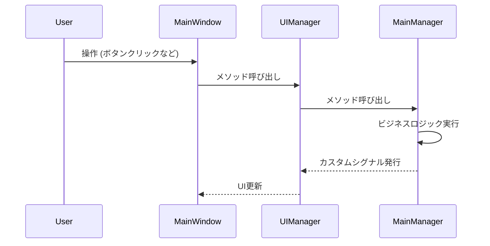
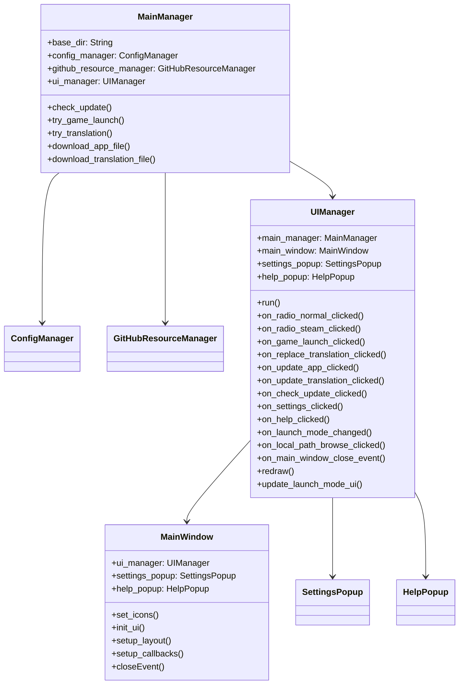

# System Patterns

このプロジェクトは、クリーンアーキテクチャとイベント駆動アーキテクチャに基づいた設計を採用します。

## クリーンアーキテクチャのレイヤー構造

1.  **Entities (エンティティ):** ビジネスロジックの中核となるデータとルール (例: `Config`)
2.  **Use Cases (ユースケース):** アプリケーション固有のビジネスルール (今は `MainManager` が担当)
3.  **Interface Adapters (インターフェースアダプター):** ユースケース層と外部フレームワーク/ツールとの間のインターフェース (例: `MainManager`, `ConfigManager`, `GitHubResourceManager`, `UIManager`)
4.  **Frameworks & Drivers (フレームワークとドライバー):** 具体的な実装 (例: PySide6, requests, ファイルシステム)

## イベント駆動アーキテクチャ

*   `UIManager` と `MainWindow` (GUI) の間で、カスタムシグナルを介して情報をやり取りする。
*   `UIManager` は、`MainWindow` からのイベントを受け取り、`MainManager` のメソッドを呼び出す。
*   `MainManager` は、処理の結果を `UIManager` のカスタムシグナルとして発行する。
*   `UIManager` は、シグナルを受信して `MainWindow` のUI要素を更新する。
*   `SettingsPopup`の`QLineEdit`の`textEdited`シグナルが、`UIManager`のカスタムシグナルを発行する。
*   `UIManager`のカスタムシグナルが、`MainManager`のプロパティを更新する。



## システムアーキテクチャ

1.  ユーザーが GUI を操作する。
2.  GUI (`MainWindow`) は、`UIManager` のメソッドを呼び出す。
3.  `UIManager` は、`MainManager` のメソッドを呼び出す。
4.  `MainManager` は、ビジネスロジックを実行し、完了時に `UIManager` のカスタムシグナルを発行する。
5.  `UIManager` は、シグナルを購読し、GUIの更新など、必要な処理を行う。

## 各モジュールの役割

*   **設定管理モジュール (`ConfigManager`)**:
    *   設定ファイル (`config.json`) の読み込み、保存、管理を行う。
    *   設定項目:
        *   PlanetSide 2 のインストールフォルダ (ローカルパス)
        *   起動モード (通常版/Steam版)
        *   アプリのアップデートサーバー URL
        *   翻訳のアップデートサーバー URL
        *   翻訳バージョン
        *   アプリバージョン
*   **ネットワークモジュール (`GitHubResourceManager`)**:
    *   GitHub リポジトリへの接続確認
    *   最新リリースのタグ名取得
    *   アセットのダウンロード
*   **GUI モジュール (`ui`)**:
    *   `MainWindow`: ユーザーインターフェースの初期化、表示、イベント処理
    *   `UIManager`: `MainManager` と `MainWindow` の間のインターフェース
    *   `SettingsPopup`: 設定ポップアップ
    *   `HelpPopup`: ヘルプポップアップ
*   **`MainManager`**:
    *   アプリケーション全体の制御と、各モジュール間の連携を行う。
    *   ビジネスロジックを実行する。
    *   `UIManager` を介してGUIとやり取りする。
    *   コンストラクタで `base_dir` を受け取る。
    *   設定の取得/設定、アップデート確認、ゲーム起動、日本語化などの機能を提供する。

## デザインパターン

*   **依存性逆転の原則:** `MainManager` は `UIManager` のインターフェース (カスタムシグナル) に依存する。
*   **単一責任の原則:** 各モジュールは、単一の責任を持つ。
*   **イベント駆動:** モジュール間の結合を疎にするために、カスタムシグナルを介して情報をやり取りする。

## モジュールの依存関係図



## ファイル構成

```
project_root/
├── README.md
├── requirements.txt
├── data/
│   └── config.json
├── src/
│   ├── main.py
│   ├── const/
│   │   └── const.py
│   ├── system/
│   │   ├── config_manager.py
│   │   ├── github_resource_manager.py
│   │   └── main_manager.py
│   └── ui/
│       ├── help_popup.py
│       ├── main_window.py
│       ├── settings_popup.py
│       └── ui_manager.py
